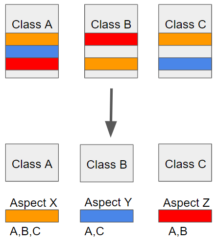
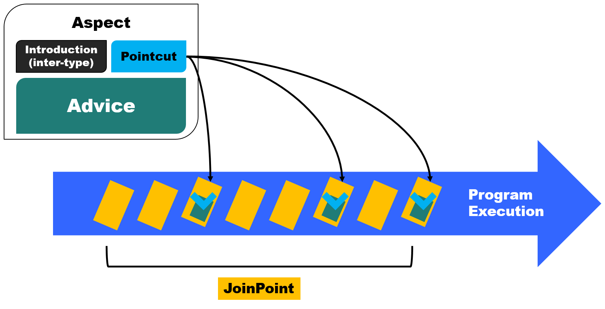

# AOP
AOP(Aspect-Oriented Programming) : 메소드나 객체의 기능을 핵심 관심사(Core Concern)와 공통 관심사(Cross-cutting Concern)로 나누어 프로그래밍하는 것
로깅, 보안, 트랜잭션 관리 등과 같은 **공통적인 관심사를 모듈화 하여 코드 중복을 줄이고 유지 보수성을 향상**하는데 도움



관점 지향 프로그래밍에서는 소스코드에서 반복적으로 사용하는 코드를 하나로 묶어서 모듈화하여 재사용성과 유지 보수성을 높일 수 있다



**cross-cutting concerns(횡단 관심사) :** 로직 전 또는 후에 실행되어야하는 공통적인 작업

**advice :** aspect가 해야하는 작업과 시기

**target :** advice가 적용될 객체

**join point :** advice를 적용할 수 있는 지점들. 메서드, 필드, 객체, 생성자 등 Spring AOP에서는 메서드가 실행될 때만 적용되도록 한정

**point cut :** 실제 advice가 적용될 지점. point cut은 join point 중 advice가 적용되는 지점

**proxy :** advice를 target 객체에 적용하면 생성되는 객체. Aspect를 구현하기 위해 프레임워크로부터 만들어진 객체

**aspect :** AOP에서는 횡단관심사를 aspect라는 특별한 객체로 모듈화(advice와 point cut을 합친 것)

**weaving :** target 객체에 aspect를 적용해서 새로운 프록시 객체를 생성하는 절차

### **Spring AOP 동작 방식**

1. Spring 컨테이너가 애플리케이션 빈을 생성할 때, AOP 프록시(proxy)를 생성하여 대상 객체에 Advice를 적용
2. 이 프록시는 클라이언트가 호출한 메서드 실행 시 실제 대상 객체 대신 Advice를 포함한 프록시 메서드를 호출하여, 사전에 정의한 로직을 실행

## **코드 예제**

```java
import org.aspectj.lang.JoinPoint;
import org.aspectj.lang.annotation.Aspect;
import org.aspectj.lang.annotation.Before;
import org.springframework.stereotype.Component;

@Aspect
@Component
public class LoggingAspect {
    // com.example.service 패키지 내 모든 메서드 실행 전 로깅 처리
    @Before("execution(* com.example.service.*.*(..))")
    public void logBefore(JoinPoint joinPoint) {
        System.out.println("메서드 실행 전: " + joinPoint.getSignature().getName());
    }
}
```

`@Aspect` 는 해당 클래스가 Aspect

`@Before` 어노테이션은 지정한 포인트컷(`execution(* com.example.service.*.*(..))`)에 해당하는 메서드 실행 전에 `logBefore()` 메서드를 실행

### **Spring AOP의 장점과 활용**

**모듈화 :** 로깅, 트랜잭션, 보안 등의 공통 관심사를 비즈니스 로직과 분리하여 개발 가능

**유지보수성 :** 횡단 관심사 코드가 하나의 Aspect로 집중 관리되므로, 수정이나 확장이 용이

**코드 중복 제거 :** 여러 클래스에서 동일하게 반복되는 코드를 Aspect로 분리하여 재사용성을 향상

**런타임 동적 위빙 :** 런타임에 프록시를 통해 동적으로 Advice를 적용할 수 있으므로, 컴파일 타임 변경 없이 기능을 추가 가능

핵심 관심사 : 각 객체가 가져야 할 본래의 기능

공통 관심사 : 여러 객체에서 공통적으로 사용되는 코드

---
### 출처
[AOP의 기본 개념과 Spring에서의 적용 방법](https://velog.io/@youjung/Spring-AOP)