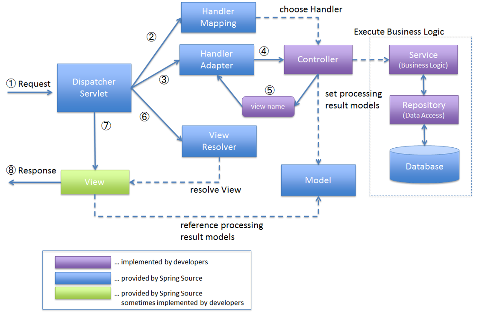

# 스프링 MVC
**Spring MVC** : Spring에 내장되어 있는 Model-View-Controller 구조를 이용해서 Web Application을 개발하는 프레임워크

Spring MVC와 MVC는 다름

- MVC : 용도별로 코드를 분리한 디자인 패턴. 개발자가 직접 구현
- Spring MVC : 스프링이 제공하는 Framework. 이미 만들어진 클래스들

Model : 어플리케이션에서 사용할 데이터 관리

View : 사용자가 보는 화면, Model data의 렌더링을 담당

Controller : 전체를 제어하는 부분, View와 Model 사이의 인터페이스 역할

## **Spring MVC Framework의 구조**

보라 : 개발자가 직접 만드는 것
파란 : spring framework이 기본적으로 제공하는 것,
초록 : spring framework이 제공하지만 개발자가 수정할수도 있는 것

**DispatcherServlet :** HTTP 요청을 최초로 받아들이고, 적절한 컴포넌트로 라우팅

**HandlerMapping :** 들어온 요청 URL과 컨트롤러(Handler) 사이의 매핑 정보를 관리

**HandlerAdapter :** DispatcherServlet이 찾은 컨트롤러(Handler)를 실행할 수 있도록 어댑터 역할

**Controller :** 클라이언트의 요청을 실제로 처리하는 비즈니스 로직의 진입점

**Model 및 ModelAndView :** 컨트롤러에서 생성된 데이터를 View에 전달하는 객체

**ViewResolver :** 컨트롤러가 반환한 논리적 뷰 이름을 실제 물리적 뷰로 매핑

**View :** 최종 사용자에게 보여지는 UI, Model에서 전달받은 데이터를 포맷하여 사용자에게 전달

### **동작 흐름**

1. 요청 수신 및 초기 처리
2. HandlerMapping을 통한 컨트롤러 매핑
3. HandlerAdapter를 통한 컨트롤러 호출
4. 컨트롤러의 요청 처리
5. ViewResolver를 통한 뷰 선택
6. 뷰 렌더링 및 응답 전송
---
### 출처
[Spring MVC란?](https://yeoon.tistory.com/76)