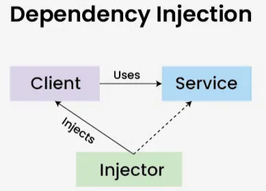

# 의존성 주입(DI)
**DI(Dependency Injection)** : 객체가 필요로 하는 의존 객체를 외부에서 제공하는 방식(객체 간의 결합도를 낮추는 데 도움)



**클라이언트 클래스 :** 서비스에 의존

**서비스 클래스 :** 클라이언트 클래스에 서비스를 제공

**Injector 클래스 :** 서비스 클래스 객체를 클라이언트 클래스에 주입하는 역할

## **의존성 주입 방식**

**생성자 주입(Constructor Injection) :** 객체 생성 시점에 생성자를 통해 의존성을 주입(**권장**)

```java
@Component
public class OrderService {
    private final PaymentService paymentService;
    @Autowired
    public OrderService(PaymentService paymentService) {
        this.paymentService = paymentService;
    }
}
```

`final` 키워드 사용 가능 → 불변성 유지

순환 참조(Circular Dependency) 문제를 조기에 발견 가능

테스트 시 명확한 의존성 주입 가능

---

**필드 주입 (Field Injection) :** 필드에 `@Autowired`를 직접 적용하는 방식(권장X)

```java
@Component
public class OrderService {
    @Autowired
    private PaymentService paymentService;
}
```

🔹 **단점**

`final` 사용 불가 → 의존성을 변경할 수 있어 불안정함

DI 컨테이너 없이 객체 생성이 어려움 (테스트 불편)

순환 참조 문제를 런타임 시점에서 발견

---

**수정자(Setter) 주입 :** setter 메서드를 통해 의존성을 주입하는 방식(**선택적 의존성에 적합)**

```java
@Component
public class OrderService {
    private PaymentService paymentService;
    @Autowired
    public void setPaymentService(PaymentService paymentService) {
        this.paymentService = paymentService;
    }
}
```

선택적 의존성 주입 가능

테스트에서 Mock 객체 주입 용이

필수 의존성 주입을 보장할 수 없음

객체 상태가 변할 가능성이 있음 (불변성 X)

## **Spring에서 의존성 주입을 처리하는 방법**

**@Component와 @Autowired사용(Spring이 직접 관리)**

```java
@Component
public class PaymentService {
    public void processPayment() {
        System.out.println("결제 처리");
    }
}

@Component
public class OrderService {
    private final PaymentService paymentService;
    @Autowired
    public OrderService(PaymentService paymentService) {
        this.paymentService = paymentService;
    }
}
```

`@Component`를 붙이면 **Spring 컨테이너가 해당 클래스를 빈(bean)으로 등록**하고, `@Autowired`를 사용하면 **자동으로 의존성이 주입**

---

**@Configuration과 @Bean사용(수동 등록)**

```java
@Configuration
public class AppConfig {
    @Bean
    public PaymentService paymentServicㅔ
    e() {
        return new PaymentService();
    }
    @Bean
    public OrderService orderService() {
        return new OrderService(paymentService());
    }
}
```

 `@Bean`을 사용하면 직접 객체를 생성하고 주입할 수 있으며, **명확한 의존 관계를 설정 할 수 있음**

빈(Bean) : 스프링 컨테이너가 관리하는 자바 객체

의존 : 클래스 A가 클래스 B의 기능을 사용한다고 하면 A는 B에 의존

순환 참조 : 둘 이상의 클래스나 빈(Bean)이 서로를 참조하는 상황을 의미