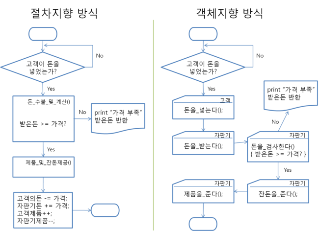

# 객체지향 프로그래밍
프로그램을 데이터와 처리 방법으로 나누는 것이 아니라, 프로그램을 객체(object) 단위로 나누고 이들의 상호작용으로 설계하는 방식

**객체** : 메소드와 변수(데이터)의 모임

### 절차지향 프로그래밍

절차 지향 프로그래밍은 프로그램을 기능중심으로 "**무엇을 어떤 절차로 할 것인가**"가 핵심 (어떤 기능을 어떤 순서로 처리하는가에 초점을 맞춘다)

객체 지향 프로그래밍은 객체가 중심이 되며 "**누가 어떤 일을 할 것인가**"가 핵심이 된다 (객체의 역할을 정의하고 상호작용하는 것에 초점을 맞춘다)

### 특징

##### 추상화
객체들의 공통적인 특징(기능, 속성)을 정의하는 것
객체지향적 관점에서는 클래스를 **정의**하는 것을 추상화라고 할 수 있다
자바에서는 추상 클래스와 인터페이스도 있다

##### 캡슐화

서로 연관있는 속성과 기능들을 하나의 캡슐로 만들어 데이터를 외부로부터 보호하고 내부의 동작을 감추는 것

##### 상속성

기존의 클래스가 가진 특징(메서드, 데이터)을 재활용 해 새로운 클래스를 작성하는 것

상위 클래스로부터 확장된 여러 개의 하위 클래스들이 모두 상위 클래스의 속성과 기능들을 간편하게 사용할 수 있다

클래스를 재사용할 수 있어 반복적인 코드를 최소화하고 공유하는 속성과 기능에 간편하게 접근하여 사용할 수 있다

##### 다형성

객체의 속성이나 기능이 그 맥락에 따라 다른 역할을 수행할수 있는 객체 지향의 특성

동일한 명령의 해석을 연결된 객체에 의존하는 것(오버라이딩, 오버로딩)

**오버라이딩(Overriding)** : 부모클래스의 메소드와 같은 이름을 사용하며 매개변수도 같되 내부 소스를 재정의하는 것
**오버로딩(Overloading)** : 같은 이름의 함수를 여러 개 정의한 후 매개변수를 다르게 하여 같은 이름을 경우에 따라 호출하여 사용하는 것

### 장단점

- 소프트웨어의 재사용을 지향해 생산성 향상
- 캡슐화 특징으로 실제로 구현되는 부분을 외부에 드러나지 않도록 하여 정보를 은닉해 보안성 향상
- 캡슐화와 격리구조에 때문에 절차지향 프로그래밍과 비교하면 실행 속도가 느리다

---
### 출처
[객체 지향](https://www.incodom.kr/%EA%B0%9D%EC%B2%B4_%EC%A7%80%ED%96%A5)