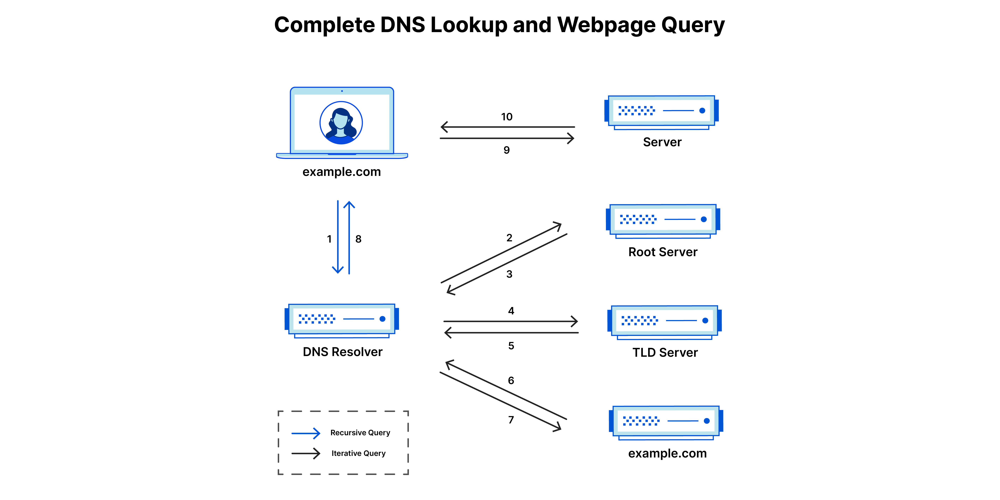

# DNS
Domain Name System
도메인을 IP로 변환해 영문과 숫자로 된 복잡한 IP 주소를 기억할 필요가 없다.

### DNS 과정

1. 사용자가 웹 브라우저에 'example.com'을 입력하면, 쿼리가 인터넷으로 이동하고 DNS 재귀 확인자가 이를 수신합니다.
2. 이어서 확인자가 DNS 루트 이름 서버(.)를 쿼리합니다.
3. 루트 서버가 도메인에 대한 정보를 저장하는 최상위 도메인(TLD) DNS 서버(.com 등)의 주소로 확인자에 응답합니다. example.com을 검색할 경우의 요청은 .com TLD를 가리킵니다.
4. 확인자가 .com TLD에 요청합니다.
5. TLD 서버가 도메인 이름 서버(example.com)의 IP 주소로 응답합니다.
6. 재귀 확인자가 도메인의 이름 서버로 쿼리를 보냅니다.
7. example.com의 IP 주소가 이름 서버에서 확인자에게 반환됩니다.
8. 이어서, DNS 확인자가, 처음 요청한 도메인의 IP 주소로 웹 브라우저에 응답합니다.

DNS 조회의 8단계를 거쳐 example.com의 IP 주소가 반환되면, 이제 브라우저가 웹 페이지를 요청할 수 있습니다.

9. 브라우저가 IP 주소로 HTTP 요청을 보냅니다.
10. 해당 IP의 서버가 브라우저에서 렌더링할 웹 페이지를 반환합니다(10단계).

재귀적 쿼리 : 쿼리를 보낸 클라이언트에 서버가 최종 결괏값을 반환하는 서버 중심 쿼리

반복적 쿼리 : 최종값을 받을 때까지 클라이언트에서 쿼리를 계속 진행하는 방식

TTL : DNS에 질의해 응답받은 결괏값을 캐시에서 유지한 시간

DNS 확인자 : DNS 조회의 첫 번째 단계이며, 최초 요청을 한 클라이언트를 처리한다.
확인자는 URL이 IP 주소로 변환되는 일련의 쿼리를 시작한다.

--- 
##### 출처
[DNS란 무엇입니까?](https://www.cloudflare.com/ko-kr/learning/dns/what-is-dns/)
