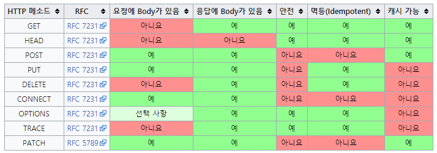

# HTTP 메서드

클라이언트가 서버에게 요청의 목적이나 종류를 알리는 수단

## HTTP 메서드 종류

GET : 파라미터를 통해 리소스를 조회할 때 사용

POST : 신규 리소스를 등록 하거나 파라미터가 아닌 메시지 바디를 통해 요청 데이터 or 프로세스를 처리하는데 사용

PATCH : 리소스의 일부를 변경할 때 사용

PUT : 대상 리소스를 덮어씌워 변경하거나, 대상 리소스가 없다면 새로 추가

DELETE : 리소스를 삭제

## HTTP 메서드의 속성

**안전 :** 호출해도 리소스가 변경되지 않는 성질

**멱등 :** 동일한 요청을 여러 번 보냈을 때, 서버에 미치는 의도된 영향이 동일한 경우

**캐시 가능 :** 응답 결과 리소스를 캐싱해서 효율적으로 사용할 수 있는가에 대한 여부

### 안정성

GET : 안정성 만족
POST, PUT, PATCH, DELETE : 안정성 만족X

GET 메서드는 데이터를 조회하는 기능, 리소스를 변경 및 수정하지 않으니 안전한 HTTP 메소드

POST, PUT, PATCH, DELETE 와 같은 메서드들은 데이터에 변경이 발생하거나, 서버에서 삭제되기 때문에 안전하지 않은 HTTP 메서드

메서드가 전체적인 시스템 장애로부터 안전하다는 의미X

### 멱등성

**HTTP 메소드의 멱등성이 필요한 이유**
HTTP 멱등성이 필요한 이유는 요청의 재시도 때문 
멱등성을 가진다면 요청이 실패한 경우에 재시도 요청을 하면 된다. 그렇지 않다면 리소스가 이미 처리되었는데 중복 요청을 보낼 수 있다.
멱등성을 고려하여 재시도 요청을 해야 한다.

**POST**
POST는 서버로 데이터를 전송하여 새로운 자원을 생성하는 역할

요청을 여러번 보내는 경우 매번 새로운 자원이 생겨나는 것이며 서버의 상태가 변경되는 것을 의미

**PUT**
대상 리소스를 덮어씌워 변경하거나, 대상 리소스가 없다면 새로 추가

대상 리소스가 없다면 PUT이 POST와 같은 동작

해당 자원이 이미 있다면 데이터만 덮어쓴다.

요청을 한번하든 여러번하든 결국 서버의 상태는 같아지니, PUT은 멱등

**PATCH**
PUT이 리소스 전체 교체 라면, PATCH는 리소스의 부분적인 수정을 할 때 사용된다.

PATCH의 특이한 점은 기본적으로 멱등성을 가지지 않는 메서드인데, 그 구현을 PUT과 동일한 방식으로 할 경우 멱등성을 가지게 되는 특성을 지니고 있다

**ex)** PATCH의 동작을 '증가'를 통한 변경이라고 하면 멱등적이지 않은 설계

PUT과 PATCH 메소드의 중요한 차이점은 전체 교체, 일부 교체 행위의 차이가 아니라, PUT 메소드는 반드시 멱등성을 보장하지만 PATCH 메소드는 멱등성을 보장하지 않을 수도 있다는 것

### 캐시가능

캐시 : 브라우저 자체도 하나의 소프트웨어라 캐시 공간을 가지고 있는데, 요청했던 데이터에 대해 다시 전송할 필요가 없도록 브라우저가 임시적으로 데이터를 보관하고 있는 장소

GET, POST, PATCH 메소드는 스펙 상으로 캐시가 가능하지만 실제로는 GET, HEAD 정도만 캐시로 이용

POST, PATCH 는 기본적으로 데이터 변경이 되는 메서드이기 때문에, 데이터가 변경되게 되면 원본 데이터 또한 변경되기에 캐시 데이터 불일치 문제가 생기기 때문