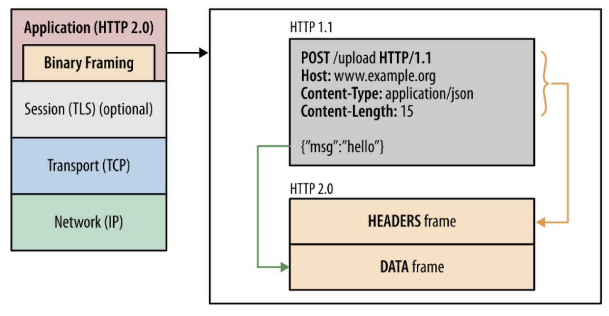
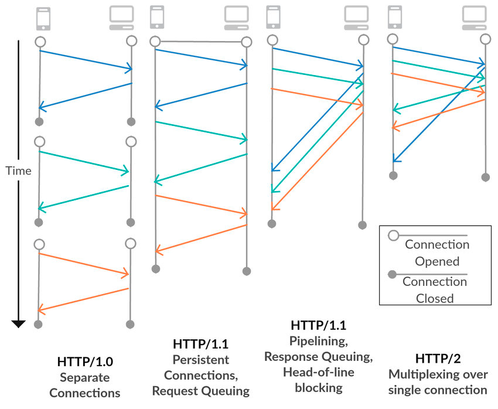

### HTTP/1.0
- 연결 한번에 하나의 요청만을 처리 할 수 있습니다. 그로인해 RTT가 증가하는 단점을 가지고 있습니다.
- 버전 정보와 요청 method가 함께 전송되기 시작
- 코드압축, 이미지 Base64인코딩 등의 기능을 사용합니다.

코드 압축 : 개행문자, 빈칸 제거

이미지 Base64 인코딩 : 이미지를 문자열로 인코딩(크기는 커지지만 이미지에 대해 요청할 필요X)

### HTTP/1.1
- 한번의 연결 이후 지정한 timeout 동안 연결을 유지(keep-alive)해 RTT감소
- 앞 요청의 응답을 기다리지 않고 여러 요청을 연속적으로 보내고 그 순서에 맞춰 응답을 받는 방식 사용
- 동시에 여러개의 요청을 처리하는 것이 아니라 HOL Blocking문제가 발생할 수 있습니다.

HOL Blocking(Head Of Line Blocking) :  네트워크에서 같은 큐에 있는 패킷이 첫번째 패킷에 의해 지연될 때 발생하는 성능 저하 현상

 

### HTTP/2.0

- 멀티 플렉싱, 헤더 압축, 서버 푸시, 요청의 우선순위 처리를 지원하는 프로토콜
- 메시지를 프레임 단위로 분할하고 바이너리로 인코딩해 전송속도가 빨라졌습니다.
- 하나의 스트림에서 유실이 발생되거나 문제가 생기면 결국 다른 스트림도 문제가 해결될 때 까지 지연되는 현상이 발생(HOL Blocking)

멀티 플렉싱 : 하나의 연결에 여러개의 스트림을 가질 수 있게 되어 동시에 여러 요청을 처리
(응답은 순서 상관없이 스트림으로 주고 받음)

서버 푸시 : 클라이언트 요청없이 서버가 바로 리소스를 푸시할 수 있는 기능

# HTTP/3.0
UDP 기반의 전송 프로토콜
TCP의 구조적 문제로 성능 향상이 어렵다고 판단하여 UDP 기반의 QUIC를 사용했습니다.
QUIC(Quick UDP Internet Connections)은 TCP의 3-way handshake과정을 최적화 하는 것에 초점을 두고 개발 됐습니다.
