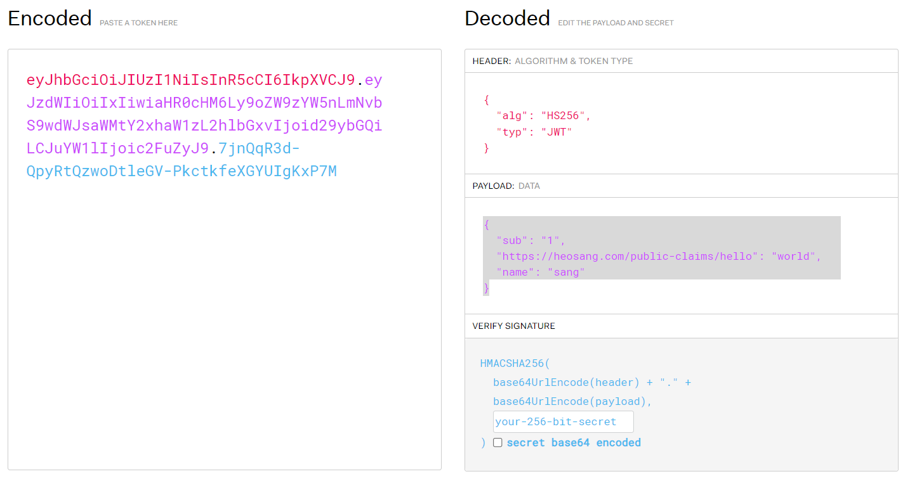

# JWT

Json Web Token

당사자 간의 정보를 JSON 개체로 안전하게 전송하기 위한 독립적인 방법을 정의하는 개방형 표준([rfc7519](https://datatracker.ietf.org/doc/html/rfc7519))

HMAC 또는 RSA 또는 ECDSA를 사용하는 공개/개인 키 쌍을 사용하여 서명할 수 있고 디지털 서명을 통해 확인하고 신뢰할 수 있다

### 구조
헤더, 내용, 서명의 . 으로 구분되는 3부분으로 구성
`<header>.<payload>.<signiture>`

##### header
알고리즘 및 토큰 타입 2가지 정보

alg : 해싱 알고리즘 (일반적으로  HMAC SHA256, RSA)
typ : 토큰 타입(JWT)

```json
{
  "alg": "HS256",
  "typ": "JWT"
}
----------
// 인코딩 결과
eyJhbGciOiJIUzI1NiIsInR5cCI6IkpXVCJ9
```

##### 내용
토큰에 담을 정보(클레임)들
클레임(claim)은 사용자 및 추가 데이터에 대한 설명으로 name:value 구조
3가지 유형
- 등록된(registered) 클레임
  필수는 아니지만 권장되는 미리 정의된 클레임(iss : 발행자, exp : 만료시간, sub : 주제 등)

- 공개(public) 클레임
  사용자 정의 클레임으로, 공개용 정보를 위해 사용
  충돌을 방지하기 위해 이름을 URI 형식으로 짓는다
  ```json
  "https://heosang.com/public-claims/hello": "world"
  ```

- 비공개(private) 클레임
  사용자 정의 클레임으로, 서버와 클라이언트 간의 정보 공유를 위해 생성된 클레임
  ```json
  "name": "sang"
  ```

```json
{
  "sub": "1",
  "https://heosang.com/public-claims/hello": "world",
  "name": "sang"
}
----------
// 인코딩 결과
eyJzdWIiOiIxIiwiaHR0cHM6Ly9oZW9zYW5nLmNvbS9wdWJsaWMtY2xhaW1zL2hlbGxvIjoid29ybGQiLCJuYW1lIjoic2FuZyJ9
```

##### 서명

정보가 도중에 변경되지 않았는지 확인하는데 사용되며 개인키로 서명된 토큰의 경우 보낸사람이 누구인지 확인 할 수 있다

```json
HMACSHA256(
  base64UrlEncode(header) + "." +
  base64UrlEncode(payload),
  mysecret)
```



### 용도
- 인가 : Authorization, 가장 일반적인 시나리오
  사용자가 로그인하면 이후 요청에 JWT가 포함되어 사용자가 해당 토큰으로 허용되는 서비스 및 리소스에 액세스할 수 있다. 오버헤드가 적고 다양한 도메인에서 쉽게 사용할 수 있다는 점 때문에 현재 JWT를 널리 사용하는 기능
  ```json
  //로그인 이후에는 bearer 스키마를 사용해 Authorization 헤더에 jwt를 넣어 보낸다
  Authorization: Bearer <token>
  ```
- 정보 교환 : 당사자 간에 정보를 안전하게 전송하는 좋은 방법
  공개/개인 키 쌍을 사용하여 JWT에 서명할 수 있으므로 보낸 사람이 누구인지 확인할 수 있다
  또한 서명을 통해 콘텐츠가 변조되지 않았는지 확인할 수도 있다


---
### 출처
[rfc7519](https://datatracker.ietf.org/doc/html/rfc7519)
[JSON 웹 토큰 소개](https://jwt.io/introduction)