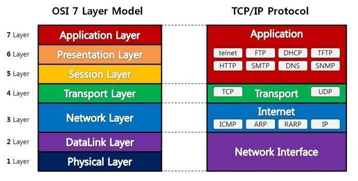

## OSI 7계층

### 나누는 이유

통신이 일어나는 과정을 단계별로 알 수 있고
이상이 생기면 그 단계만 수정할 수 있기 때문

1계층 : 물리계층

- 데이터를 전기신호로 변환해서 주고받는 기능

2계층 : 데이터링크 계층

- 송수신되는 정보를 관리하여 안전하게 전달되도록 도와주는 역할
- 프레임에 Mac 주소를 부여하고 에러검출, 재전송, 흐름제

3계층 : 네트워크 계층

- 데이터를 목적지까지 가장 안전하고 빠르게 전달하는 기능을 담당
- 라우팅, 흐름 제어, 오류 제어, 세그먼테이션 등을 수행

4계층 : 트랜스포트 계층

- 사용자들이 신뢰성있는 데이터를 주고 받을 수 있도록 해준다
- 포트를 열어두고, 프로그램들이 전송을 할 수 있도록 제공

5계층 : 세션 계층

- 데이터가 통신하기 위한 논리적 연결을 담당한다
- 통신 장치 간 상호작용 및 동기화를 제공

6계층 : 프레젠테이션 계층

- 데이터 표현에 대한 독립성을 제공하고 암호화하는 역할을 담당한다.
- 파일 인코딩, 명령어를 포장, 압축, 암호화한다.

7계층 : 어플리케이션 계층

- 응용 프로세스 간의 정보 교환을 담당
- 사용자 인터페이스, 전자우편, 데이터베이스 관리 등의 서비스를 제공