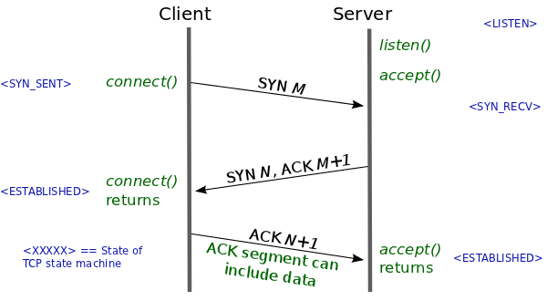
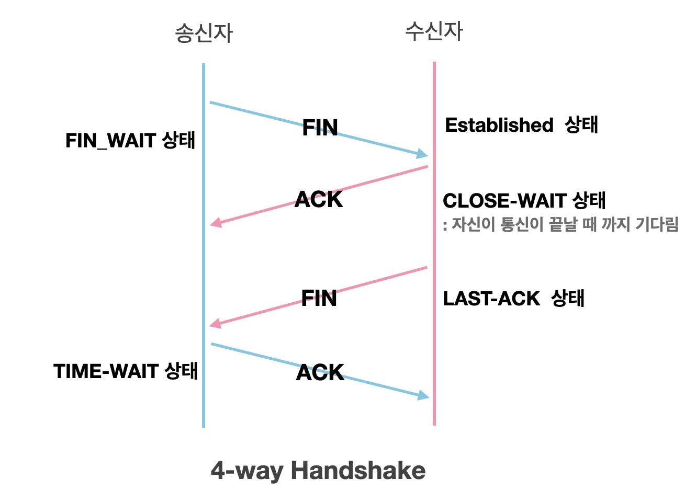

## TCP 3,4  handshake

### 3way handshake

안전한 통신을 위한 사전 연결작업

1. 클라이언트는 서버에 접속을 요청하는 SYN 패킷 전송
 이때 클라이언트는 SYN 을 보내고 SYN/ACK 응답을 기다리는 SYN_SENT 상태
2. 서버는 SYN요청을 받고 클라이언트에게 요청을 수락한다는 ACK 와 SYN flag 가 설정된 패킷을 발송
클라이언트가 다시 ACK으로 응답하기를 기다리는 SYN_RECEIVED 상태
3. 클라이언트는 서버에게 ACK을 보내고 이후로부터는 연결이 이루어지고 데이터전송 
이때 서버 상태가 ESTABLISHED

TCP 헤더에 플래그라는 값을 넣어 통신(논리적인 TCP 연결회선 제어 및 데이터 관리를 위해 사용)

- SYN : 연결 시작 용도로 사용. 연결이 시작될 때, SYN에 1로 표시
- ACK : ACK 번호가 유효할 경우, 1로 표시해 보냄
초기 SYN이 아닌 모든 패킷은 기존 메시지에 대한 응답이므로 ACK 플래그가 1로 표기
- FIN : 연결 종료 시 1로 표시.데이터 전송을 마친 후 정상적으로 양방향 종료 시 사용
- RST : 연결 종료 시 1로 표시.연결 강제 종료를 위해 연결을 일방적으로 끊을 때 사용
- URG : 긴급 데이터인 경우, 1로 표시, 순서에 상관없이 먼저 송신
- PSH : 서버 측에서 전송할 데이터가 없거나 데이터 버퍼링 없이 응용 프로그램으로 즉시 전달할 것을 지시할 때

### 4way handshake

TCP 연결을 종료하기위해 수행

1. 클라이언트가 연결을 종료하겠다는 FIN플래그를 전송
2. 서버는 일단 확인메시지를 보내고 자신의 통신이 끝날때까지 기다림(**TIME_WAIT**상태)
3. 서버가 통신이 끝났으면 연결이 종료되었다고 클라이언트에게 FIN플래그를 전송
4. 클라이언트는 확인했다는 메시지를 서버에 전송

서버에서 FIN을 전송하기 전에 전송한 패킷이 지연이나 유실로 인한 재전송 등으로 인해 FIN패킷보다 늦게 도착하면 패킷 드롭

이러한 현상에 대비하여 클라이언트는 서버로부터 FIN을 수신하더라도 일정시간(디폴트 240초) 동안 세션을 남겨놓고 잉여 패킷을 기다림(**TIME_WAIT )**

L4 Load Balancer는 IP, Port 를 기준으로 스케줄링 알고리즘을 통해 부하를 분산

L7 Load Balancer는 IP, Port 이외에도 URI, Payload, Http Header, Cookie 등의 내용을 기준으로 부하를 분산

# 헬스 체크

로드 밸런서에서는 부하 분산을 하는 각 서버의 서비스를 주기적으로 헬스 체크해 정상적인 서비스 쪽으로만 부하를 분산하고 비정상적인 서버는 그룹에서 제외해 트래픽을 보내지 않음

## 헬스 체크 방식

### ICMP

VIP에 연결된 리얼서버에 대해 ICMP(Ping)로 헬스 체크

단순히 서버가 살아 있는지 여부만 체크하는 방법이므로 잘 사용하지 않음

### TCP 서비스 포트

로드 밸런서에서 서버의 서비스 포트를 등록했으면 리얼 IP의 해당 포트로 SYN을 주고 받고, ACK를 주고 받고 FIN을 보내 헬스 체크 종료

### TCP 서비스 포트 Half Open

헬스 체크로 인한 부하를 줄이거나 빨리 헬스 체크 세션을 끊기 위해 사용

초기 3방향 핸드셰이크와 동일하게 SYN을 보내고 SYN,ACK를 받지만 ACK 대신 RST를 보낸 세션 종료

### HTTP 상태 코드

웹서비스에 대한 응답을 확인

3방향 핸드셰이크를 거치고 HTTP를 요청해 정상적인 상태 코드를 응답하는지 확인