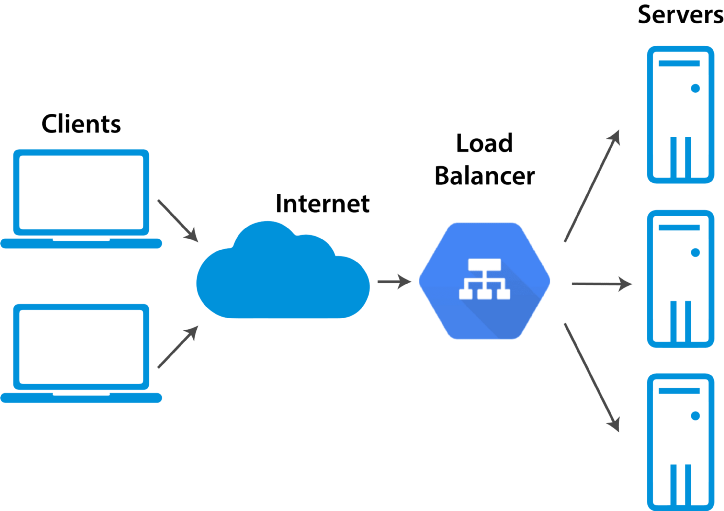

## 로드밸런싱

- 서비스 가용성을 높이기 위해 일반적으로 두 대 이상의 서버로 구성
- 서버를 이중화해 서비스 호출을 분리한 경우, 서비스 장애 발생가능
- 위 문제점을 해결하기 위해 L4, L7스위치라는 로드 밸런서 사용
- 로드밸런서에 다수의 서버가 등록되어 서비스 요청이 오면 사용자 별로 서버에 요청을 분산시켜 부하 분산
- 로드밸런서에서 서비스를 위한 가상 IP(VIP)를 제공하고 사용자는 가상 IP를 통해 서버로 접근

### 부하 분산 알고리즘

| 알고리즘 | 기능 |
| --- | --- |
| 라운드 로빈 | 구성된 장비에 부하를 순차적으로 분산, 총누적 세션 수는 동일하지만 활성화된 세션수는 달라질 수 있음 |
| 최소 접속방식 | 가장 활성화된 세션수가 적은 장비로 부하 분산 |
| 가중치 기반 라운드 로빈 | 장비에 가중치를 두어 높은 장비에 부하를 많이 분산하는 라운드 로빈 방식 |
| 가중치 기반 최소 접속 방식	 | 위와 동 |
| 해시 | 해시 알고리즘을 이용한 부하 분산 |

## 해시

서버의 부하를 고려하지 않고 클라이언트가 같은 서버에 지속적으로 접속하도록 하기 위해 사용하는 방식

서버 상태를 고려하지 않고 해시 알고리즘을 통해 얻은 결과로 어떤 장비에 부하를 분산할지 결정

항상 같은 장비로 서비스 분산, 세션을 유지해야 하는 서비스에 적합한 방식