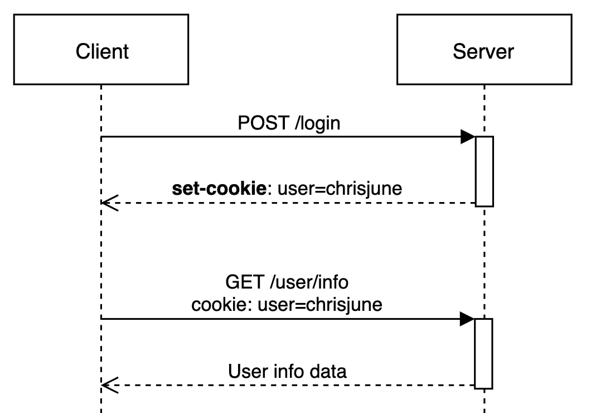
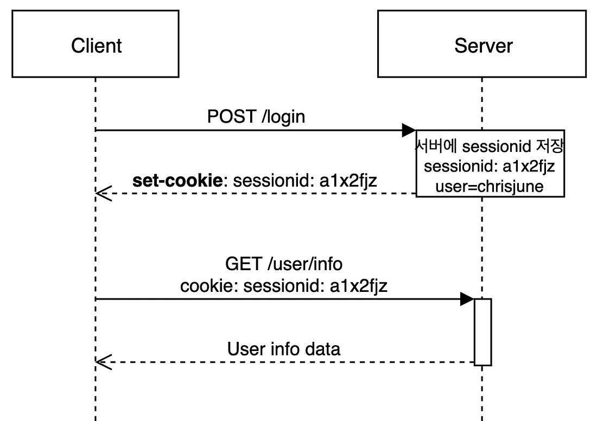

# 쿠키,세션
HTTP의 비연결성(connectionless) 와 비상태성(stateless)을 보완하기 위해 쿠키와 세션 사용

**ex)** 쿠키와 세션을 사용하지 않으면 페이지를 이동할 때 마다 계속 로그인을 해야한다

### 쿠키
클라이언트에 저장되는 키와 값이 들어있는 데이터 파일
- 클라이언트의 상태 정보를 로컬에 저장, 참조
- 클라이언트에 300개까지 쿠키저장 가능, 도메인당 20개의 값만 가질 수 있음, 쿠키값은 4KB까지 저장
- Response Header에 Set-Cookie 속성을 사용하면 클라이언트에 쿠키를 만들 수 있다
- 쿠키는 사용자가 요청하지 않아도 브라우저가 Request시에 Request Header를 넣어서 자동으로 서버에 전송

##### 구성요소
name : 이름
value : 값
expires : 삭제 시기
domain : 사용되는 도메인
path : 쿠키를 반환할 경로
##### 동작 방식

1. 클라이언트가 페이지를 요청
2. 서버에서 쿠키를 생성
3. HTTP 헤더에 쿠키를 포함 시켜 응답
4. 브라우저가 종료되어도 쿠키 만료 기간까지 클라이언트에서 보관
5. 같은 요청을 할 경우 HTTP 헤더에 쿠키를 함께 보냄
6. 서버에서 쿠키를 읽어 이전 상태 정보를 변경 할 필요가 있을 때 쿠키를 업데이트 하여 변경된 쿠키를 HTTP 헤더에 포함시켜 응답

### 세션

- 서버에서는 클라이언트를 구분하기 위해 세션 ID를 부여하며 웹 브라우저가 서버에 접속해서 브라우저를 종료할 때까지 인증상태를 유지
- 사용자 정보를 서버에 저장해 쿠키보다 보안에 좋지만, 사용자가 많아질수록 서버 메모리를 많이 차지하게 된다
- 클라이언트가 Request를 보내면, 해당 서버가 클라이언트에게 유일한 ID를 부여하는 데 이것이 세션 ID

### 차이점
|| Cookie |	Session |
|---|---|---|
|저장위치	| 클라이언트	| 서버 |
|저장형식	|	키,값이 있는 String형	|	Object	|
|만료시점	|쿠키 저장시 설정(설정 없으면 브라우저 종료 시)|정확한 시점 모름
|리소스|	클라이언트의 리소스	|서버의 리소스|
|용량제한|	한 도메인 당 20개, 한 쿠키당 4KB	|제한없음|

쿠키는 브라우저를 종료해도 파일로 남지만 세션은 브러우저 종료시 삭제

