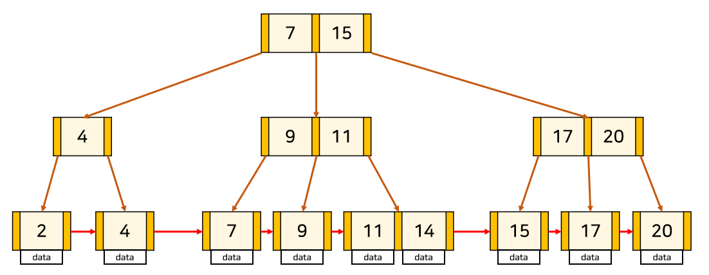

# 인덱스

인덱스는 데이터베이스 테이블에 대한 검색 성능의 속도를 높여주는 자료 구조

인덱스를 생성하면 해당 컬럼의 데이터들을 정렬하여 별도의 메모리 공간에 데이터의 물리적 주소와 함꼐 저장된다. 
인덱스 생성 시 오름차순으로 정렬하기 때문에 정렬된 주소체계라고 표현할 수 있다.

### 인덱스의 자료구조
인덱스는 여러 자료구조를 이용해서 구현하 수 있는데, 대표적인 자료구조로 해시 테이블과 B+Tree

##### 해시 테이블

컬럼의 값과 물리적 주소를 (key, value)의 한 쌍으로 저장하는 자료구조이다. 
- 해시 테이블은 등호 연산에 최적화되어있기 때문에 인덱스에서 잘 사용하지 않는다.
- 데이터베이스에선 부등호 연산이 자주 사용되는데, 해시 테이블 내의 데이터들은 정렬되어 있지 않으므로 특정 기준보다 크거나 작은 값을 빠른 시간 내에 찾을 수가 없다.

##### B+Tree

B+Tree는 대부분의 DBMS 사용하고 있는 인덱스
구조는 Root Node(기준)/Branch Node(중간)/Leaf Node(말단)으로 구성되며 계층적 구조

- Node는 데이터가 존재하는 공간
- Leaf Node만 인덱스(Key)와 함께 데이터(Value)를 가지고 있고, 나머지 Root Node와 Branch Node는 데이터를 위한 인덱스(Key)만을 갖는다.
- Leaf Node에만 데이터를 저장
- Root Node에서 경로를 확인 후 그에 알맞는 Node들로 이동하여 최종적으로 원하는 데이터가 있는 Leaf Node에 도달

### 장점

데이터가 정렬되어 있기 때문에 테이블에서 검색과 정렬 속도를 향상

### 단점
인덱스의 가장 큰 문제점은 정렬된 상태를 계속 유지시켜야 한다는 점
- 정렬을 변경시키는 INSERT, UPDATE, DELETE 명령어가 수행된다면 정렬을 위한 부하가 발생한다.
- 부하를 최소화하기 위해 인덱스는 **데이터 삭제**라는 개념을, **인덱스를 사용하지 않는다** 라는 작업으로 대신
- 인덱스 관리를 위해 데이터베이스의 약 10%에 해당하는 저장공간이 추가로 필요하다. 때문에 너무 많이 인덱스를 생성하면 하나의 쿼리문을 빠르게 만들 수 있지만 대신에 전체적인 데이터베이스의 성능 부하를 초래