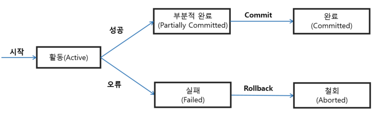
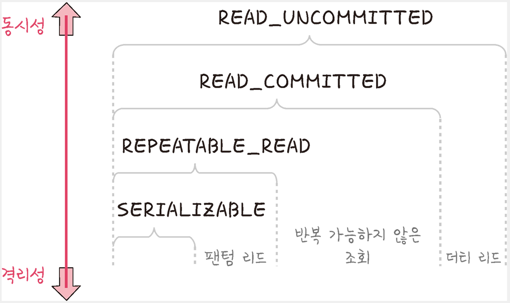

# 트랜잭션  
DB에서 하나의 논리적 기능을 수행하기 위한 작업의 단위(여러개의 쿼리를 하나로 묶는 단위)
원자성, 일관성, 독립성, 지속성(ACID) 이라는 특징을 가지고 있다

### 특징
##### 원자성(Atomicity)
- 분해가 불가능한 최소단위인 원자처럼 동작한다는 의미(all or nothing)
- 트랜잭션 내의 모든 연산이 모두 성공하는 경우, 어떤 연산도 수행되지 않는 두가지 경우만 있다

##### 일관성(Consistency)
- 미리 정의된 규칙에서만 수정이 가능한 특성
- 트랜젝션 전,후의 데이터베이스의 상태가 Correct State여야 한다.
- 트랜잭션 작업이 시작되기 전에 DB 상태가 일관된 상태였다면 트랜잭션 작업이 종료된 후에도 일관성 있는 상태를 유지해야한다
ex)데이터 타입이 정수형이라면 트랜젝션 이후에도 정수형으로 유지

Correct State : 도메인의 유효범위, 무결성 제약조건 등의 제약조건을 위배하지 않는 정상적인 상태

##### 고립성(Isolation)
- 트랜잭션 작업 수행 중에 다른 트랜잭션에 영향을 주어서도 안되고, 다른 트랜잭션들에 의해 간섭을 받아서도 안 된다는 것을 의미(여러개의 고립 수준으로 나뉘어 고립성 보장)

##### 지속성(Durablility)
- 성공적으로 수행된 트랜잭션은 그 조작이 영구적으로 반영된다는 의미
- 트랜잭션이 성공하면 저장장치에 로그로 기록하고 시스템에 이상이 발생했을 때 로그를 사용해 이상 발생 전까지 복원하는 것으로 지속성을 실현하고 있다

### 상태

트랜잭션은 논리적으로 5가지의 상태에 있을 수 있다.

**Active** : 현재 실행 중인 상태
**Failed** : 실행되다 오류가 발생해서 중단된 상태
**Aborted** : 비정상 종료되어 Rollback이 수행된 상태
**Partially Committed** : 연산이 마지막까지 실행되고 Commit이 되기 직전 상태
**Committed** : 성공적으로 종료되어 Commit 연산을 실행한 후의 상태

### 연산
**commit** : 트랜잭션에 대한 작업이 성공적으로 끝났고 데이터베이스가 다시 일관된 상태에 있을 때, 이 트랜잭션이 행한 갱신 연산이 완료된 것을 트랜잭션 관리자에게 알려주는 연산

**rollback** : 하나의 트랜잭션 처리가 비정상적으로 종료되어 데이터베이스의 일관성을 깨뜨렸을 때, 이 트랜잭션의 일부가 정상적으로 처리되었더라도 트랜잭션의 원자성을 구현하기 위해 이 트랜잭션이 행한 모든 연산을 취소(Undo)하는 연산

### 격리수준

SERIALIZABLE : 트랜잭션을 순차적으로 진행시키는 것을 의미
동시에 같은 행에 접근할 수 없다

REPEATABLE_READ : 하나의 트랜잭션이 수정한 행을 다른 트랜잭션이 수정할 수 없도록 막지만 새로운 행을 추가하는 것은 막지 않다

READ_COMMITTED : 가장 많이 사용하는 격리수준, 트랜잭션이 커밋하지 않은 정보는 읽을 수 없다(커밋 완료된 데이터만 조회 허용)

READ_UNCOMMITTED : 하나의 트랜잭션이 커밋되기 이전 다른 트랜잭션에 노출되는 문제가 있지만 가장 빠른 장점이 있다

