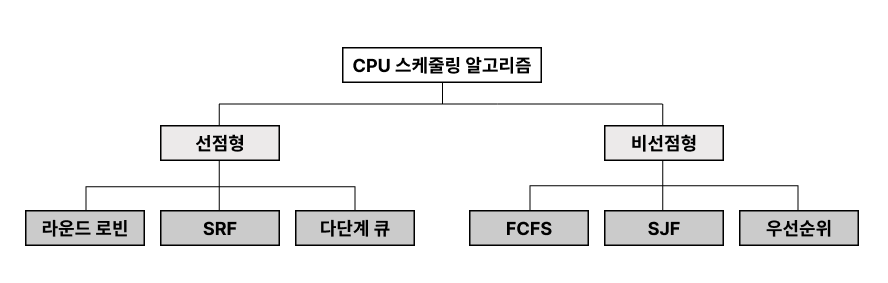

# CPU 스케줄링 알고리즘
어떤 프로그램에 CPU 소유권을 줄 것인지 결정하는 알고리즘

> 스케줄러를 사용하는 상황
> 1. running -> waiting(I/O wait)
> 2. running -> ready(timeout)
> 3. waiting -> ready(I/O completion)
> 4. terminated
> 
> 스케줄링이 1,4번 상황에서만 발생하면 비선점형, 모든 경우는 선점형 스케줄링

### 비선점형 방식

프로세스가 스스로 CPU 소유권을 포기하는 방식(강제로 프로세스 중지X)
컨텍스트 스위칭으로 인한 부하가 적음

**FCFS** : First Come First Served, 먼저온거 먼저 처리하는 알고리즘
- 오래 수행되는 프로세스로 인해 준비큐에서 오래 기다리는 단점

**SJF** : Shortest Job First, 실행 시간이 짧은 프로세스 먼저 실행하는 알고리즘
- 긴 시간을 가진 프로세스가 실행되지 않는 단점

**우선순위** : SJF에서 오래된 작업일수로 우선순위를 높이는 방법을 통해 단점 보완

### 선점형 방식

사용하고 있는 프로세스를 알고리즘에 의해 중단시키고 다른 프로세스에 소유권을 할당하는 방식
- 현대 운영체제가 사용
- 처리 시간이 긴 프로세스의 CPU 독점을 막을 수 있다
- 컨텍스트 스위칭 증가로 오버헤드가 커질 수 있다

**라운드 로빈** : 각 프로세스에 동일한 할당 시간을 주고 그 시간 안에 끝나지 않으면 다시 준비 큐의 뒤로 가는 알고리즘
- 할당시간이 크면 FCFS, 작으면 컨텍스트 스위칭 증가  

**SRF** : Shortest Remaining Time First
- SJF는 중간에 짧은 작업이 들어와도 기존 작업을 수행, SRF는 중지하고 해당 프로세스를 수행
- 잦은 알고리즘 실행과 컨텍스트 스위칭으로 오버헤드 증가

**다단계 큐** : 우선순위에 따른 준비큐를 여러개 사용, 큐마다 다른 스케쥴링 알고리즘을 적용
- 기아현상이 발생 할 수 있다

