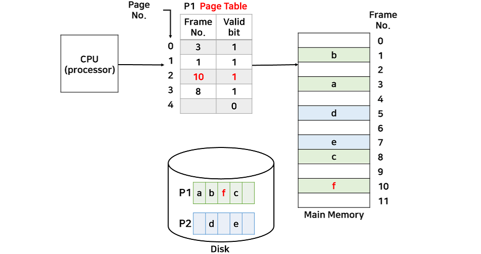

# 가상메모리
물리 메모리 크기의 한계를 극복하고, 메모리보다 큰 프로세스를 수행하기 위해 사용하는 기술

- 프로세스 실행에 필요한 부분만 메모리에 올리고 나머지는 디스크에 저장하는 방식으로 구현
- 실행에 필요한 프로세스의 일부분은 일반적으로 세그먼트가 아니라 페이지 방식 사용

### 요구 페이징
현재 필요한 페이지만 메모리에 올리는 것

- p1, p2 프로세스는 각각 필요한 페이지만 메모리에 할당
- page table의 valid bit를 통해 메모리에 페이지가 있는지 확인
- cpu에서 valid bit가 0인 페이지에 접근하면 인터럽트 신호 발생하고 OS내부의 ISR로 점프(디스크 내부의 P1에 있는 2번째 페이지를 메모리에 할당하는 작업 수행)

---
### 출처
[[운영체제(OS)] 15. 가상메모리](https://velog.io/@codemcd/%EC%9A%B4%EC%98%81%EC%B2%B4%EC%A0%9COS-15.-%EA%B0%80%EC%83%81%EB%A9%94%EB%AA%A8%EB%A6%AC)