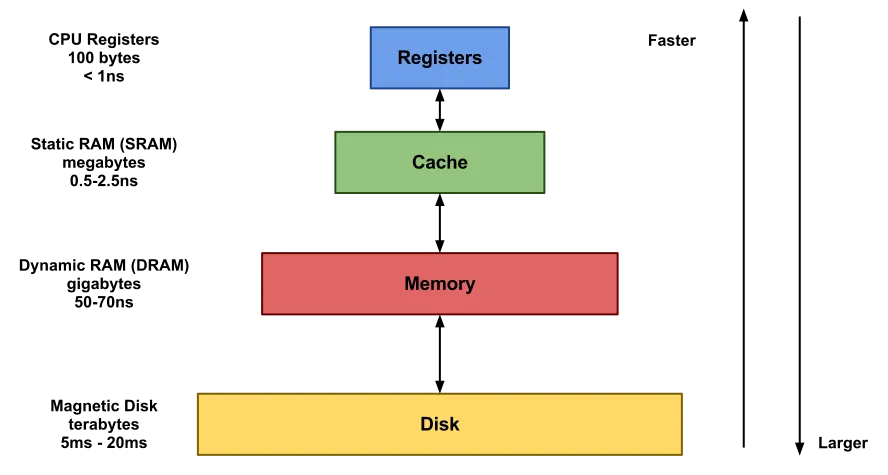

# 메모리 계층 구조

각각 특징이 있는 여러 종류의 기억 장치를 함께 사용하여 최적의 효율을 낼 수 있게 하는 것

빠른 저장 장치는 용량에 비해 가격이 비싸고, 용량이 넉넉한 저장 장치는 처리 속도가 느리다

- **레지스터** : 제일 빠른 메모리
  - CPU 계산 과정에서 작동
  - CPU가 요청을 처리하는데 필요한 데이터를 일시적으로 저장하는 공간

- **캐시 메모리**
  - 레지스터와 캐시는 CPU 내부에 존재
  - CPU와의 거리에 따라 L1 캐시, L2 캐시, L3 캐시 등으로 나뉜다

- **메인 메모리** : CPU와 분리되어 있는 메모리
  - 프로그램을 직접 구동하는 데 사용되는 주 기억 장치

### 지역 참조성
프로그램이 일부분만을 자주 사용하는 현상

- 이를 이용해 자주 쓰이는 데이터, 또는 자주 쓰일 것 같은 데이터를 메모리에서 캐시로 읽어온다

---
### 출처
[메모리 계층 구조](https://namu.wiki/w/%EB%A9%94%EB%AA%A8%EB%A6%AC%20%EA%B3%84%EC%B8%B5%20%EA%B5%AC%EC%A1%B0)