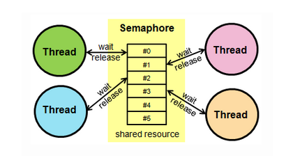

### 뮤텍스

공유자원을 사용하기 전에 설정하고 사용한 후에 해제하는 잠금

- Key에 해당하는 어떤 오브젝트가 있으며 이 오브젝트를 소유한 스레드/프로세스만 공유자원에 접근할 수 있다.

- 동기화 대상이 하나

### 세마포어 

{: width="80%" height="80%"}

멀티프로그래밍 환경에서 공유 자원에 대한 접근을 변수로 제한하는 방법

- 간단한 정수값과 두가지 함수(wait(), signal())로 접근 처리
- 동기화 대상이 하나 이상

wait() : 세마포어 값이 양수면 감소시키고 아니면 기다림
signal() : 세마포어 값 증가

##### 차이

가장 큰 차이점은 동기화 대상의 개수

뮤텍스는 Locking(잠금) 메커니즘으로 잠금을 건 스레드만이 임계 영역을 나갈때 락을 해제할 수 있다. 하지만 세마포어는 Signaling(신호) 메커니즘으로 락을 걸지 않은 스레드도 signal을 사용해 락을 해제할 수 있다. 세마포어의 카운트를 1로 설정하면 뮤텍스처럼 활용할 수 있다.

**공유자원** : 시스템안에서 각 프로세스, 스레드가 함께 접근할 수 있는 자원

**임계영역** : 공유 자원에 접근할 때 순서 등의 이유로 결과가 달라지는 영역

상호배제 : 한번에 한 프로세스만 임계영역에 들어갈 수 있음

한정대기 : 특정 프로세스가 영원히 임계영역에 들어하지 못하면 안됨

융통성 : 한 프로세스가 다른 프로세스의 일을 방해해서는 안됨