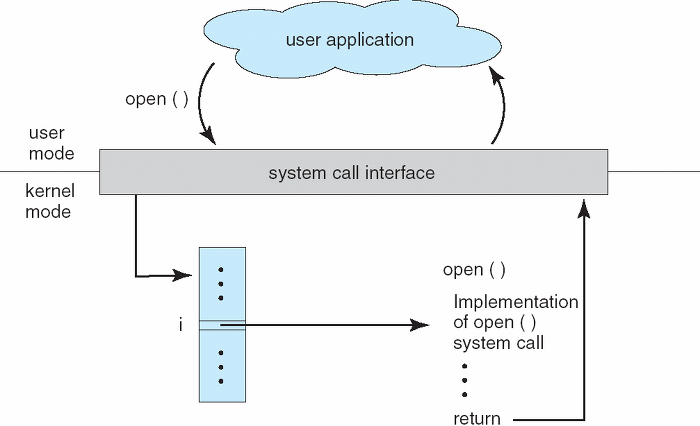

# 시스템 콜

응용 프로그램의 요청에 따라 커널에 접근하기 위한 인터페이스

- 유저레벨의 함수만으로는 많은 기능을 구현하기 힘들기 때문에 커널의 도움을 받아야한다.
- 커널 모드를 통한 작업은 반드시 시스템 콜을 거쳐 수행하도록 설계되어 있습니다. 

시스템 콜 발생에서 OS로 매개변수 전달하는 방법
- 매개변수를 CPU 레지스터에 전달
- 매개변수를 메모리에 저장하고 주소를 레지스터에 전달
- 매개변수를 스택에 전달

#### 시스템 콜의 종류
1. 프로세스 컨트롤
  - 프로세스 생성 및 종료
  - 메모리에 로드, 실행
  - 프로세스 속성 값 확인, 지정
  - 메모리 할당
2. 파일 관리
  - 파일 생성, 파일 삭제
  - 열기, 닫기, 읽기, 쓰기
3. 장치 관리
  - 디바이스 부착, 분리, 읽기, 쓰기 등
4. 정보 유지
  - 시간 설정 등
5. 통신
  - 통신 연결 생성 제거
  - 상태정보 전달
6. 보안
  - Permission 획득, 설정