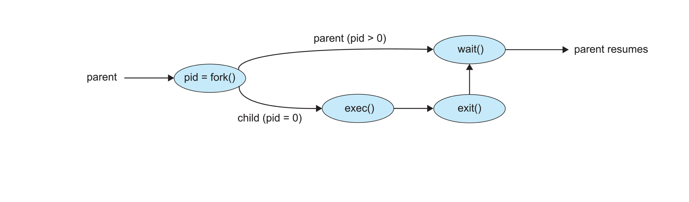

### 좀비프로세스
프로세스가 종료되었음에도 불구하고 메모리상에서 프로세스에 대한 정보가 사라지지 않은 상태

- 자식 프로세스가 부모 프로세스보다 먼저 죽는 경우 부모 프로세스가 종료 상태를 회수하기 위해 커널이 자식 프로세스의 최소한의 정보(PID, 종료 상태 등)를 남겨둔다
- 부모 프로세스가 wait()을 호출해 이 상태를 회수하면 남은 정보가 제거되어 자식 프로세스 소멸
- 부모 프로세스가 wait()을 호출하지 않아 정보가 메모리에 남아있는 경우 좀비 프로세스

### 고아프로세스
부모가 자식 프로세스보다 먼저 종료되면 그 자식 프로세스는 고아 프로세스

- 고아 프로세스는 시스템의 자원을 낭비할 수 있고, 시스템이 프로세스가 종료될 때까지 추적을 해야 하기 때문에 성능 저하의 원인
- 운영체제는 이러한 고아 프로세스를 허용하지 않으며 부모 프로세스가 먼저 종료되면 자식 프로세스의 새로운 부모 프로세스로 init(PID = 1)이 설정된다
- 고아 프로세스가 작업을 종료하면 init 프로세스가 wait함수를 호출하여 고아 프로세스의 종료 상태를 회수함으로써 좀비 프로세스가 되는것을 방지

init 프로세스 : 유닉스 계열의 운영체제에서 부팅 과정 중 생성되는 최초의 프로세스, 시스템이 종료될때까지 계속 살아있는 데몬 프로세스

fork() : 현재 돌아가고 있던 프로세스를 복사해서 다른 프로세스를 만든다.

exec() : 프로세스로 하여금 다른 바이너리를 가지고 새로 시작하도록 한다. 

wait() : 자식 프로세스가 종료될 때까지 현재 프로세스의 동작을 멈추는 시스템 콜 함수

exit() : 현재 프로세스가 종료되어 SIGCHLD 시그널이 부모 프로세스로 전달되고, wait() 된 부모 프로세스는 자식 프로세스의 exit() 함수에 의해 정상 종료가 됨을 알 수 있습니다.