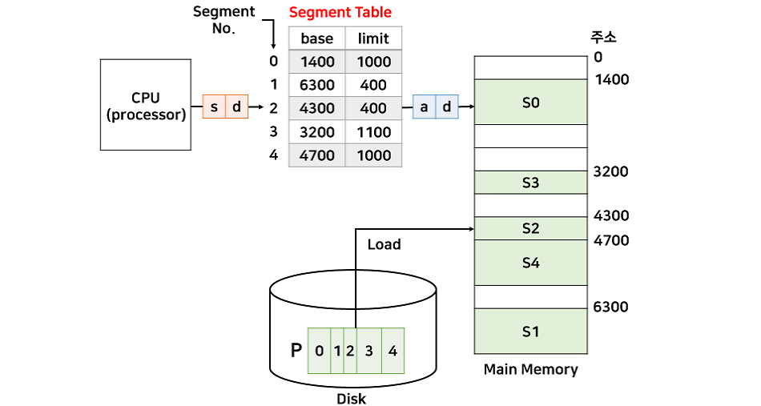

# 세그멘테이션과 페이징
메모리 단편화를 해결하는 방법

메모리 단편화 : 사용가능한 메모리가 충분히 존재하지만 할당이 불가능한 상태

### 메모리 관리기법

##### 연속 메모리 기법

프로그램 전체가 메모리에 연속적으로 할당되는 기법
- **고정 분할 기법** : 메모리가 고정된 파티션으로 분할(**내부 단편화 발생**)
- **동적 분할 기법** : 파티션들이 동적으로 생성되고 자신의 크기와 같은 파티션에 메모리 할당(**외부 단편화 발생**)

내부 단편화 : 프로세스가 크기보다 더 많은 메모리를 할당받을 때 발생
외부 단편화 : 메모리 할당, 해제 작업의 반복으로 할당된 메모리들의 사이에 사용하지 않는 메모리가 발생하는 경우(남은 메모리 공간이 충분해도 프로세스 할당 불가)

##### 불연속 메모리 기법

프로그램의 일부가 서로 다른 주소 공간에 할당될 수 있는 기법

Page : 프로세스를 고정된 크기로 분할한 블록
Frame : 메모리를 고정된 크기로 분할한 블록
Segment : 서로 다른 크기의 논리적 블록

### 페이징
프로세스의 주소 공간을 고정된 사이즈의 페이지 단위로 나누어 물리적 메모리에 불연속적으로 할당하는 방식

- 메모리는 Frame이라는 고정크기로 분할되고, 프로세스는 Page라는 고정크기로 분할됨
- 페이지와 프레임은 크기가 같다
- 페이지와 프레임을 대응시키는 page mapping 과정을 위해 paging table이 필요
- 연속적이지 않은 공간도 활용할 수 있기 때문에 외부 단편화 문제 해결
- 페이지 테이블에는 각 페이지 번호와 해당 페이지가 할당된 프레임의 시작 물리 주소를 저장
- 페이지의 크기가 클수록 내부 단편화가 커짐

### 세그멘테이션
프로세스를 서로 크기가 다른 논리적인 블록 단위인 세그먼트로 분할하여 메모리에 할당

- 각 세그먼트는 연속적인 공간에 저장
- 세그먼트들의 크기가 서로 다르기 때문에 프로세스가 메모리에 적재될 때 빈 공간을 찾아 할당하는 기법
- 페이징처럼 mapping을 위한 segment table 필요
- 정확히 영역을 나누기 때문에 보호와 공유 기능을 효율적으로 수행(중요한 부분을 분리해 저장 + code, data, stack같이 코드 영역은 한 번에 저장)
- 중간에 메모리를 해제하면 생기는 외부 단편화 문제가 발생 할 수 있다

---
### 출처
[[OS] 페이징(Paging)과 세그멘테이션(Segmentation)](https://cocoon1787.tistory.com/860)