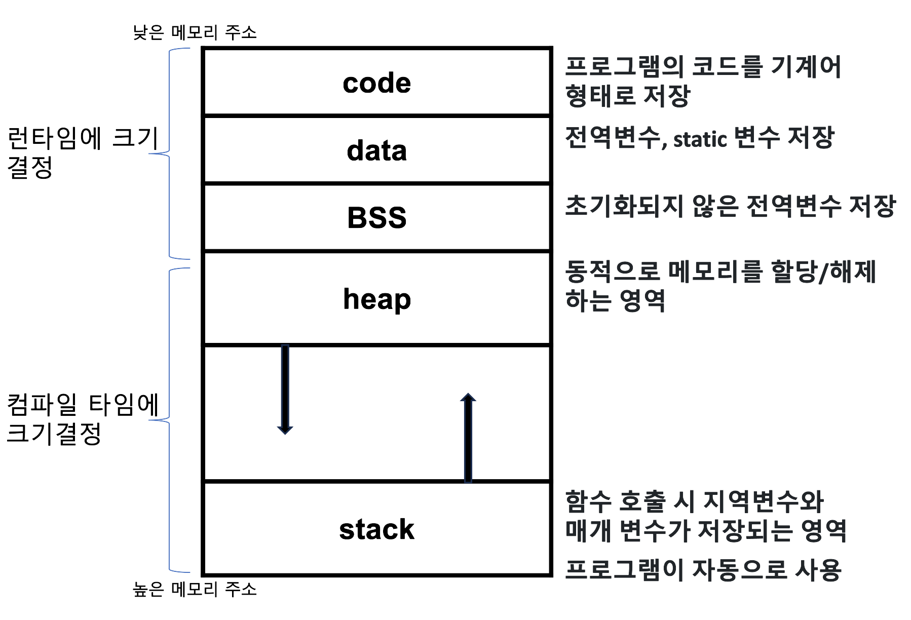

# 프로세스 메모리 구조
실행 중인 프로세스가 메모리에서 어떻게 구성되는지를 나타내는 개념
code(text), data, heap, stack 영역으로 구성

### Code 영역
실행할 프로그램의 코드가 저장
CPU는 이 영역에서 명령어를 하나씩 가져와 처리

### Data 영역
전역변수와 정적변수가 저장됩니다. 이 변수들은 프로그램이 시작될 때 할당되어 프로그램 종료 시 소멸
- BSS(Block Started by Symbol) 영역에는 초기화 되지 않은 전역변수가 저장. 초기화 된 전역변수는 Data 영역에 저장되어 비휘발성 메모리인 ROM에 저장되는데 이 부분은 비용이 많이 들어 RAM에 저장될 것과 ROM에 저장될 것을 구분하기 위해 영역을 구분해 사용

### Heap 영역
동적 데이터 영역
- 메모리 주소 값에 의해서만 참조되고 사용되는 영역. 따라서, 프로그램 동작 시(런타임)에 크기가 결정

### Stack 영역
지역변수, 매개변수, 리턴값 등 잠시 사용되었다가 사라지는 데이터를 저장하는 영역
- 함수 호출 시 할당되고 함수 반환 시 소멸
- 로드 시(컴파일) 크기가 결정
- stack 영역은 변수 단위가 아닌 stack frame단위로 쌓이게 되고 stack frame은 함수 단위로 나눠진다. (지역 변수, 전달받은 인자, 함수가 끝나고 실행할 다음 명령어의 주소를 담고있다.)
