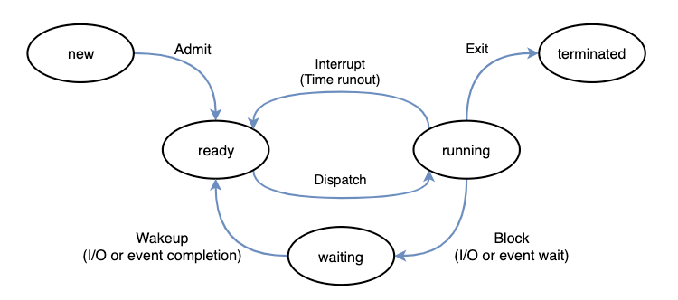

### 프로세스
메모리에 적재되어 실행중인 프로그램

##### 프로세스 상태

|상태|설명|
|--|--|
|new|프로세스 생성|
|ready|CPU에 실행되기 위해 대기하는 상태|
|running|프로세스가 실행되는 상태|
|waiting|특정 자원이나 이벤트를 기다리는 상태|
|terminated|실행을 완료한 상태|

##### 상태 전이 동작
|동작|전이 과정|설명|
|--|--|--|
|dispatch|ready -> running|우선순위가 높은 프로세스를 CPU에 할당|
|interrupt|running -> ready|할당된 CPU 시간이 지나면 timeout interrupt가 발생해 CPU를 다른 프로세스에 양도|
|block|running -> waiting|I/O 등 자원요청 후 재할당 받을 때 까지 기다리기 위해 waiting 상태로 전이|
|wakeup|waiting -> ready|필요한 자원이 할당되면 프로세스를 waiting 상태에서 ready로 전이|

### 스레드
프로세스가 할당받은 자원을 이용하는 실행 흐름의 단위
- 프로세스 내에서 code, data, heap 영역을 공유하고 돌립적인 stack영역을 할당받는다
- 메모리를 공유하기 때문에 동기화, 데드락 등의 문제가 발생할 수 있다.

---
### 출처
[완전히 정복하는 프로세스 vs 스레드 개념](https://inpa.tistory.com/entry/%F0%9F%91%A9%E2%80%8D%F0%9F%92%BB-%ED%94%84%EB%A1%9C%EC%84%B8%EC%8A%A4-%E2%9A%94%EF%B8%8F-%EC%93%B0%EB%A0%88%EB%93%9C-%EC%B0%A8%EC%9D%B4)